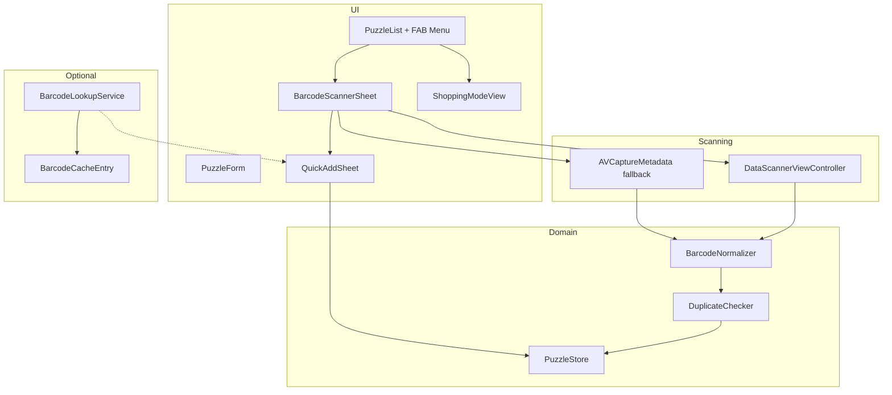

# Barcode Scanner — R&D Specification

**Status:** R&D / not implemented  
**Author:** Puzzle Buddy product + engineering  
**Last updated:** 2026-06-17  
**Target release:** 1.2+ (phased; see [Delivery phases](#delivery-phases))  
**Deployment baseline:** iOS 17.0 (`project.yml`)  
**Related docs:** [roadmap.md](roadmap.md), [user-research-garage-collector.md](user-research-garage-collector.md), [implementation-playbook.md](implementation-playbook.md)

---

## Table of contents

1. [Executive summary](#1-executive-summary)
2. [Problem statement & jobs to be done](#2-problem-statement--jobs-to-be-done)
3. [Goals, non-goals, and success metrics](#3-goals-non-goals-and-success-metrics)
4. [User personas & primary flows](#4-user-personas--primary-flows)
5. [Competitive & market context](#5-competitive--market-context)
6. [Barcode formats on puzzle packaging](#6-barcode-formats-on-puzzle-packaging)
7. [Product experience specification](#7-product-experience-specification)
8. [Data model & persistence](#8-data-model--persistence)
9. [Duplicate detection](#9-duplicate-detection)
10. [Barcode lookup & enrichment (metadata APIs)](#10-barcode-lookup--enrichment-metadata-apis)
11. [Technical architecture](#11-technical-architecture)
12. [Scanner implementation options (R&D matrix)](#12-scanner-implementation-options-rd-matrix)
13. [Recommended approach](#13-recommended-approach)
14. [UI/UX specification](#14-uiux-specification)
15. [Accessibility (WCAG 2.1 AA)](#15-accessibility-wcag-21-aa)
16. [Privacy, security, and compliance](#16-privacy-security-and-compliance)
17. [Offline & sync behavior](#17-offline--sync-behavior)
18. [Analytics & observability](#18-analytics--observability)
19. [Error handling & edge cases](#19-error-handling--edge-cases)
20. [Testing strategy](#20-testing-strategy)
21. [Delivery phases](#21-delivery-phases)
22. [Implementation file map](#22-implementation-file-map)
23. [Risks, mitigations, and open questions](#23-risks-mitigations-and-open-questions)
24. [Decision log](#24-decision-log)
25. [Appendix A — Sample API payloads](#appendix-a--sample-api-payloads)
26. [Appendix B — Competitor barcode behavior notes](#appendix-b--competitor-barcode-behavior-notes)

---

## 1. Executive summary

Puzzle Buddy users—especially collectors with large garages and thrift-store hunters—need a **fast path to catalog puzzles** and a **reliable way to avoid buying duplicates** while shopping. Today, every puzzle requires a full manual form (`PuzzleForm`). A commented `barcode` field in `PuzzleObject.swift` signals intent but nothing is shipped.

This spec defines a **phased barcode program**:

| Phase | Ship value | Engineering effort |
|-------|------------|------------------|
| **A** | `barcode` field + duplicate guard (manual entry) | Small (1–2 days) |
| **B** | Live camera scan sheet + pre-fill form | Medium (3–5 days) |
| **C** | “Do I own this?” shopping mode (scan → instant duplicate result) | Medium (2–4 days) |
| **D** | Optional online UPC enrichment + crowd cache | Large (R&D dependent) |
| **E** | Bulk scan / CSV import | Stretch |

**Strategic bet:** Phase A–C deliver 80% of user value **fully offline** with local SwiftData. External UPC APIs are optional enrichment (Phase D), not a blocker—puzzle boxes often have rich front-label text that barcode databases mislabel anyway.

**Recommended scanner stack:** `DataScannerViewController` (VisionKit) as primary on iOS 17+, with `AVCaptureMetadataOutput` fallback for devices where VisionKit Live Text scanner is unavailable or accuracy regresses.

---

## 2. Problem statement & jobs to be done

### 2.1 Observed pain (from user research)

From [user-research-garage-collector.md](user-research-garage-collector.md):

| Scenario | User need | Current gap | Severity |
|----------|-----------|-------------|----------|
| Catalog 50 boxes after organizing shelves | Scan UPC, minimal taps, move on | Full form per puzzle | **Critical** |
| Flea market / thrift shopping | “Do I already own this?” in &lt;3 seconds | Name search only; exact title match fragile | **High** |
| Rebuying same Ravensburger / Buffalo Games SKU | Stable identifier across reprints | No barcode field | **High** |
| Household with 1,000 puzzles | Bulk workflows | No scan, no CSV import | **High** |

**Synthetic user quotes (research-backed):**

- *“I can't tap through 1,000 forms. I need to scan the UPC and move on.”*
- *“If the title on the box says 'Winter Cabin' but I logged it as 'Cabin in Winter,' search won't save me.”*
- *“At the flea market I need offline—there's no signal in the warehouse.”*

### 2.2 Jobs to be done (JTBD)

| Job | When | Success criteria |
|-----|------|------------------|
| **J1 — Fast catalog** | At home, logging owned puzzles | Scan → confirm pre-filled form → save in &lt;15 seconds |
| **J2 — Duplicate prevention** | In store, holding a box | Scan → immediate “You own this” or “Not in collection” without leaving scanner |
| **J3 — Identity anchor** | Anytime | Barcode persists as canonical key even if user edits display name |
| **J4 — Batch catch-up** | After organizing garage | Optional multi-scan queue (Phase E) |

### 2.3 Relationship to existing shipped features

Already shipped (as of 1.0 beta work in this branch):

- `source` field (gift / thrift / retail presets)
- `progressPercent` + status sync
- List search, status filters, share collage
- Demo data load/remove

Barcode complements these: **source** answers “where from”; **barcode** answers “which SKU exactly.”

---

## 3. Goals, non-goals, and success metrics

### 3.1 Goals

1. **G1 — Offline-first duplicate check** using locally stored barcodes.
2. **G2 — Reduce median time-to-add** for users who scan vs manual-only (target: 50% reduction by Phase C).
3. **G3 — Zero regressions** to accessibility, local-first privacy posture, and SwiftData stability.
4. **G4 — Clear fallback** when scan fails: manual barcode entry always available.

### 3.2 Non-goals (v1 of barcode program)

| Non-goal | Rationale |
|----------|-----------|
| Feature parity with Puzzle Tracker bulk AI scan | High complexity; competitor’s long tail |
| Guaranteed correct title/piece count from UPC | General product DBs poorly cover jigsaw puzzles |
| ISBN-only books / non-puzzle products | Out of scope unless user explicitly adds |
| Continuous background scanning | Battery + privacy; explicit scanner UI only |
| Barcode-based social sharing or public profiles | Privacy-first positioning |
| Replacing photo capture | Box photo remains primary visual identity |

### 3.3 Success metrics (90 days post Phase C)

| Metric | Target | Instrumentation |
|--------|--------|-----------------|
| % of new puzzles with `barcode` set | ≥30% among scanner-eligible devices | `puzzle_added` metadata |
| Scanner sheet completion rate | ≥70% of opens → successful scan | `barcode_scan_completed` / `barcode_scan_cancelled` |
| Duplicate block rate at save | Track count (not necessarily maximize) | `duplicate_puzzle_blocked` |
| Shopping mode session success | ≥80% scans return result &lt;2s local | `shopping_scan_result` latency bucket |
| Crash-free scanner sessions | ≥99.5% | Crashlytics |
| Support tickets re: camera | &lt;5/month | Support inbox |

---

## 4. User personas & primary flows

### 4.1 Personas

**Alex — Garage collector (1,000 puzzles)**  
Needs batch cataloging and duplicate prevention. Often poor cell signal in garage. Values export/backup (future).

**Sam — Casual gift receiver**  
Gets puzzles from family (`source` = “Gift from Mom”). Barcode optional but nice when box is handy.

**Jordan — Thrift hunter**  
Buys incomplete boxes. Needs instant duplicate check and missing-pieces flag. Barcode on damaged boxes may be unreadable.

### 4.2 Flow F1 — Quick add via scan (Phase B)

```
Puzzle List → (+) menu → "Scan barcode"
  → Camera permission (first run)
  → Scanner sheet (viewfinder + torch toggle)
  → Scan UPC/EAN → haptic success
  → Duplicate check (local)
      → If duplicate: alert "You already have this puzzle" [View existing] [Scan another]
      → If new: Quick Add sheet (name, pieces, status pre-filled if enrichment available)
  → Save → dismiss → list updates
```

### 4.3 Flow F2 — Shopping mode / duplicate check only (Phase C)

```
Puzzle List → toolbar → "Check duplicate" (barcode.viewfinder icon)
  → Scanner (no form)
  → On scan:
      → MATCH: full-screen green result card + photo thumb + [Open puzzle]
      → NO MATCH: amber card "Not in your collection" + [Add this puzzle] [Scan again]
  → Works fully offline
```

### 4.4 Flow F3 — Manual barcode on full form (Phase A)

```
Add Puzzle (full form) → Barcode row
  → Text field OR "Scan" inline button
  → On save: duplicate guard if barcode collides (excluding self on edit)
```

### 4.5 Flow F4 — Edit existing puzzle

```
Puzzle Detail → Edit → Barcode field
  → Changing barcode re-runs duplicate check
  → Cannot save if another puzzle owns barcode (unless force? **No** — keep strict)
```

---

## 5. Competitive & market context

### 5.1 Puzzle Tracker (primary competitor)

From [roadmap.md](roadmap.md) competitive table:

- Ships **barcode scan** with bulk + manual entry.
- Top App Store review theme: **duplicate prevention while shopping**.
- Puzzle Buddy differentiator remains **simplicity, local-first, accessibility**—not feature parity.

### 5.2 Internet Puzzle Database (IPDb)

[IPDb](https://www.ipdb.plus/) is a **community puzzle archive**, not a commercial UPC API. Notable ideas to borrow:

- **Digital Assistant** — box photo → title/pieces/brand (image OCR, not barcode).
- **Hardware Link** — phone scans while desktop edits (out of scope).
- ~40k community records — potential **future partnership** or import, not Phase 1.

### 5.3 Positioning statement for barcode

> **“Know what you own before you buy it again—works offline, no account required.”**

---

## 6. Barcode formats on puzzle packaging

### 6.1 Expected symbologies

| Format | Typical use on puzzles | Normalization |
|--------|------------------------|---------------|
| **UPC-A** | US/Canada retail (12 digits) | Store as 12-digit string, no spaces |
| **UPC-E** | Compressed UPC on small boxes | Expand to UPC-A for storage |
| **EAN-13** | International (13 digits) | Store as 13-digit string |
| **EAN-8** | Small packages (rare) | Store as 8-digit string |
| **Code 128** | Internal / warehouse (less common retail) | Store raw string + symbology metadata (optional) |

**Not in v1:** QR codes on inner bags (unless user demand), Data Matrix, PDF417.

### 6.2 Normalization rules (`BarcodeNormalizer`)

```text
Input: scanned string + symbology
1. Strip whitespace, hyphens
2. If UPC-E → expand to UPC-A
3. If EAN-13 with leading 0 representing UPC-A → store both canonical forms for matching? 
   → Decision: store single canonical `barcode` string as scanned normalized UTF-8 digits
4. Validate length ∈ {8, 12, 13} OR allow 6–14 with warning for Code 128
5. Reject empty, alphabetic-only (unless Code 128)
```

**Duplicate matching** uses normalized form only.

### 6.3 Real-world capture challenges (puzzle-specific)

| Challenge | Mitigation |
|-----------|------------|
| Glossy cellophane glare | Torch toggle; guidance text “tilt box to reduce glare” |
| Damaged thrift boxes | Manual entry; optional “barcode unknown” |
| Multiple barcodes (UPC + warehouse sticker) | Prefer symbology filter UPC/EAN; show picker if 2+ within 500ms |
| Same puzzle, different UPC (region reprint) | Duplicate check is **exact barcode** only; future: fuzzy brand+pieces+name hint |
| No barcode (handmade / vintage) | Skip field; not required |

---

## 7. Product experience specification

### 7.1 Entry points

| Location | Control | Phase |
|----------|---------|-------|
| `PuzzleList` FAB | Long-press or menu on `+`: **Add puzzle** / **Scan barcode** | B |
| `PuzzleList` toolbar | **Check duplicate** (shopping mode) | C |
| `PuzzleForm` | Barcode row + scan affordance | A |
| `PuzzleDetail` stats | Display barcode; tap to copy | A |
| `Settings` → Collection | “Default add method: Form / Scan” (optional P2) | P2 |

### 7.2 FAB menu (recommended)

Replace single FAB action with menu (iOS standard):

```
[+] → Menu
  • Add puzzle (full form)     ← current default
  • Scan barcode               ← Phase B
  • Check duplicate            ← Phase C (or toolbar only)
```

Preserve `A11yID.addPuzzleButton` on primary action; add `A11yID.scanBarcodeButton`.

### 7.3 Duplicate UX

**On save (Phase A):**

```
Alert: "Already in your collection"
Body: "Another puzzle uses barcode 012345678905 (Harbor Lights)."
Buttons: [View puzzle] [Cancel]
```

**In shopping mode (Phase C):**

- Do **not** use blocking alert; use inline result card with clear color + VoiceOver announcement.

### 7.4 Pre-fill rules after scan

| Field | Pre-fill source | Confidence |
|-------|-----------------|------------|
| `barcode` | Scan | High |
| `name` | UPC API title OR empty | Low–Medium |
| `pieces` | Parse from title regex `(\d+)\s*(pc|pieces|piece)` OR API | Low |
| `brand` | API brand field (future `brand` field) | Low |
| `image` | API image URL download (Phase D) | Low |
| `status` | Default `.todo` | High |

**UX rule:** Never auto-save from scan alone. Always show confirmation sheet with editable fields.

### 7.5 Quick Add sheet (minimal form)

Fields: **Name** (required), **Pieces** (picker), **Status**, **Barcode** (read-only), Photo (optional).  
Omit rating, difficulty, time, notes in quick flow—user can edit later.

---

## 8. Data model & persistence

### 8.1 `Puzzle` runtime model (`PuzzleObject.swift`)

Add:

```swift
@Published var barcode: String? = nil
@Published var barcodeSymbology: String? = nil  // optional: "ean13", "upca"
```

**Uncomment and implement** existing roadmap field:

```swift
// var barcode // scan barcode on certain brands  ← remove comment
```

### 8.2 `PuzzleRecord` (SwiftData)

```swift
var barcode: String?
var barcodeSymbology: String?
```

**Index:** Add SwiftData fetch index on `barcode` for fast duplicate lookup at scale (1,000+ puzzles).

```swift
#Index<PuzzleRecord>([\.barcode])  // when non-nil queries are hot path
```

### 8.3 Firestore sync (`getDataFields` / `fromData`)

Add keys:

| Key | Type | Notes |
|-----|------|-------|
| `barcode` | string or `"nil"` | Match existing nullable string pattern |
| `barcodeSymbology` | string or `"nil"` | Optional |

**Migration:** Lightweight schema addition; default `nil` for existing records.

### 8.4 Validation rules

| Rule | Enforcement |
|------|-------------|
| Max length | 32 characters |
| Charset | Numeric preferred; Code 128 alphanumeric allowed |
| Uniqueness | One barcode per collection (case: local device; cloud: per user) |
| Optional | `barcode` never required to save puzzle |

### 8.5 Future: `BarcodeLookupCache` (Phase D)

Local table (SwiftData or JSON file):

```swift
@Model class BarcodeCacheEntry {
    @Attribute(.unique) var barcode: String
    var title: String?
    var brand: String?
    var imageURL: String?
    var fetchedAt: Date
    var source: String  // "go-upc", "manual", "user_correction"
}
```

User corrections override API cache for **their** pre-fill only—not global DB.

---

## 9. Duplicate detection

### 9.1 Local algorithm (Phase A–C)

```swift
enum PuzzleDuplicateCheck {
    static func findDuplicate(
        barcode: String,
        excludingID: UUID?,
        in store: PuzzleStore
    ) -> Puzzle?
}
```

Steps:

1. Normalize barcode.
2. `FetchDescriptor<PuzzleRecord>` predicate: `barcode == normalized` (if indexed).
3. Exclude `excludingID` when editing.
4. Return first match.

**Name-based fuzzy duplicate (optional P1.5):**

- Normalize name: lowercase, strip punctuation, collapse whitespace.
- If Levenshtein distance ≤ 2 OR one contains the other → **soft duplicate warning** (non-blocking).
- Barcode duplicate remains **hard block**.

### 9.2 Performance target

| Collection size | Duplicate lookup |
|-----------------|------------------|
| 100 | &lt;5 ms |
| 1,000 | &lt;20 ms |
| 5,000 | &lt;50 ms (index required) |

Benchmark in `PuzzleStoreTests` with in-memory SwiftData.

### 9.3 Cloud sync edge cases

| Case | Behavior |
|------|----------|
| Two devices add same barcode offline | Last-write-wins on sync; show conflict toast (future) |
| User A and B share account (unlikely) | Firestore rules scope per email path — same as today |

---

## 10. Barcode lookup & enrichment (metadata APIs)

### 10.1 Problem

General UPC databases (Go-UPC, Barcode Lookup, Buycott) index **retail products** but jigsaw puzzles are often misclassified or missing. Enrichment is **best-effort**, not dependable.

### 10.2 Candidate providers (R&D evaluation)

| Provider | Pros | Cons | Est. cost |
|----------|------|------|-----------|
| [Go-UPC](https://go-upc.com/) | Simple REST, bulk option | Generic product data | Paid tiers |
| [Barcode Lookup](https://www.barcodelookup.com/api) | Rich fields, images | $99+/mo; puzzle hit rate unknown | High |
| [Buycott](https://www.buycott.com/) | Large index | Commercial terms; puzzle quality TBD | Paid |
| [Open Food Facts](https://world.openfoodfacts.org/) | Free | Food-focused — poor puzzle fit | Free |
| **IPDb** | Puzzle-specific | No public barcode API; community | N/A |
| **User crowd cache** | Improves over time for Puzzle Buddy users | Cold start | Infra only |

### 10.3 R&D spike checklist (Phase D gate)

1. Collect **50 real puzzle UPCs** (Ravensburger, Buffalo Games, Galison, Springbok, Ceaco, Eurographics).
2. Run against 2–3 APIs; score:
   - Title accuracy (0–2)
   - Piece count extractable (0–2)
   - Brand correct (0–2)
   - Image usable (0–2)
3. **Go threshold:** median score ≥6/10 → integrate optional enrichment behind feature flag.
4. **No-go:** Ship scan + duplicate only; defer API spend.

### 10.4 Enrichment architecture (if go)

```
Scan → Local duplicate check → (if online & flag on) BarcodeLookupService
  → Cache in BarcodeCacheEntry
  → Pre-fill Quick Add
```

**Feature flag:** `ProductService.isBarcodeLookupEnabled` default `false`.

**Privacy:** Only barcode digits sent to API; no user id; disclose in privacy policy appendix.

### 10.5 Piece count extraction heuristic (offline, no API)

Regex on title string:

```regex
(?i)(\d{2,5})\s*(?:piece|pieces|pc|pce|pcs)\b
```

Fallback: common piece picker default unchanged.

---

## 11. Technical architecture

### 11.1 Module diagram



### 11.2 New types (proposed files)

| File | Responsibility |
|------|----------------|
| `Helpers/BarcodeNormalizer.swift` | Canonical string rules |
| `Helpers/PuzzleDuplicateChecker.swift` | Local match logic |
| `Views/Barcode/BarcodeScannerView.swift` | `UIViewControllerRepresentable` wrapper |
| `Views/Barcode/BarcodeScannerSheet.swift` | SwiftUI chrome, torch, permissions |
| `Views/Barcode/ShoppingModeView.swift` | Duplicate-only flow |
| `Views/Barcode/QuickAddPuzzleSheet.swift` | Minimal post-scan form |
| `Services/BarcodeLookupService.swift` | Phase D HTTP client |
| `Helpers/BarcodeCacheEntry.swift` | Phase D SwiftData model |

### 11.3 Integration with `PuzzleStore`

New methods:

```swift
func puzzle(matchingBarcode: String, excluding: UUID?) -> Puzzle?
func add(puzzle: Puzzle, allowDuplicateBarcode: Bool = false) throws  // guard inside
```

`add` and `update` call duplicate guard when `barcode != nil`.

### 11.4 Camera permissions

Already have `NSCameraUsageDescription` in `project.yml`:

> "Your Puzzle Buddy needs camera access to take a photo of a puzzle"

**Update copy** when barcode ships:

> "Puzzle Buddy uses the camera to photograph puzzle boxes and scan barcodes so you can catalog puzzles and check for duplicates."

Add `NSCameraUsageDescription` to `Puzzle-Buddy-Info.plist` if not generated from build settings.

### 11.5 Feature flags (`ProductService`)

```swift
static var isBarcodeScanEnabled: Bool = true  // Phase B
static var isShoppingModeEnabled: Bool = true  // Phase C
static var isBarcodeLookupEnabled: Bool = false  // Phase D
```

Launch arguments for QA:

- `-enable_barcode_lookup`
- `-disable_barcode_scan`

---

## 12. Scanner implementation options (R&D matrix)

| Option | API | Min iOS | Pros | Cons | Verdict |
|--------|-----|---------|------|------|---------|
| **A** | `DataScannerViewController` | 16+ (target 17) | Native UI, Live Text infra, Swift-friendly | Static after init; TabView resume bugs; iOS 17 accuracy reports | **Primary** |
| **B** | `AVCaptureSession` + `AVMetadataMachineReadableCodeObject` | 13+ | Full control, mature | More code: preview layer, threading, symbology config | **Fallback** |
| **C** | Third-party (CodeScanner SPM) | Varies | Fast prototype | Dependency risk, a11y variance | Spike only |
| **D** | `VNDetectBarcodesRequest` on static photos | 11+ | Works from box photo | Not live scan; slower UX | Complement to “scan from photo” P3 |
| **E** | VisionKit `DocumentCameraViewController` | 13+ | Good for OCR title | Not for barcode | Use for future box OCR |

### 12.1 DataScannerViewController — implementation notes

```swift
// Recognized types — restrict to retail barcodes
recognizedDataTypes: [
    .barcode(symbologies: [.ean8, .ean13, .upce, .code128])
]
qualityLevel: .accurate
recognizesMultipleItems: false
isGuidanceEnabled: true
isHighlightingEnabled: true
```

**Lifecycle:**

- Present scanner in **`.sheet`** or fullScreenCover, not embedded in `TabView` (avoids frozen camera bug).
- On `onAppear`: `startScanning()`; on `onDisappear`: `stopScanning()`.
- Use `.id(scannerSessionID)` to force recreation if symbology config changes.

**Delegate:**

- `dataScanner(_:didAdd:)` → take first barcode item, debounce 1s to prevent double-fire.

### 12.2 AVCapture fallback — when to use

```swift
if !DataScannerViewController.isSupported || !DataScannerViewController.isAvailable {
    // Use AVCaptureBarcodeScannerView
}
```

Also use fallback if internal QA on iOS 17+ shows &lt;90% success rate on puzzle sample set.

### 12.3 Scan from existing photo (Phase P3)

User picks box photo from library → `VNDetectBarcodesRequest` → same pipeline as live scan.  
Reuses `ImagePicker` permission patterns.

---

## 13. Recommended approach

### 13.1 Phase sequencing (engineering order)

1. **Model + normalizer + duplicate checker + form field** (Phase A)  
   — Unblocks QA without camera hardware.
2. **Scanner sheet + Quick Add** (Phase B)  
   — Primary user-facing win.
3. **Shopping mode** (Phase C)  
   — Small UI; reuses scanner.
4. **UPC enrichment spike** (Phase D gate)  
   — Data-driven go/no-go.
5. **CSV import with barcode column** (Phase E)  
   — Aligns with user-research Phase C import spec.

### 13.2 Why not start with API lookup?

- Costs money before product-market fit is proven.
- Puzzle UPC hit rate is unknown and likely &lt;50%.
- Duplicate prevention works **without** network.
- Competitor wins on scan UX, not API accuracy.

---

## 14. UI/UX specification

### 14.1 Scanner sheet layout

```
┌─────────────────────────────────┐
│  Cancel          Scan barcode   │
├─────────────────────────────────┤
│                                 │
│      [ Camera viewfinder ]      │
│      ┌─────────────────┐        │
│      │   guide frame   │        │
│      └─────────────────┘        │
│                                 │
├─────────────────────────────────┤
│  Align barcode in frame           │
│  [Torch]                         │
└─────────────────────────────────┘
```

- **Cancel:** top-left, always visible, 44pt hit target.
- **Torch:** bottom; off by default; remember per-session only.
- **Success:** green flash overlay + `UINotificationFeedbackGenerator.success`.
- **Failure / timeout:** no auto-dismiss; user can switch to manual entry.

### 14.2 Shopping mode result card

**Match:**

- Green border, checkmark icon.
- Puzzle name, pieces, status, thumbnail.
- Primary: **Open puzzle**; Secondary: **Scan another**.

**No match:**

- Neutral/amber border.
- “Not in your collection.”
- Primary: **Add puzzle** (opens Quick Add with barcode); Secondary: **Scan another**.

### 14.3 Visual design tokens

Use existing `Brand.accent`, `Brand.accentWarm`, `Brand.card`, `DS.Spacing`, `DS.Radius` from `DesignTokens.swift`.  
Scanner chrome uses **black** background (camera standard), not brand gradient.

### 14.4 Empty / permission states

| State | UI |
|-------|-----|
| Camera denied | Illustration + “Enable camera in Settings” + deep link button |
| Simulator | Debug banner “Barcode scan requires a device” + manual entry |
| `isSupported == false` | Hide scan entry points; manual only |

---

## 15. Accessibility (WCAG 2.1 AA)

### 15.1 Requirements

| Criterion | Implementation |
|-----------|----------------|
| 1.1.1 Non-text content | Scanner viewfinder labeled; result state announced |
| 2.1.1 Keyboard | N/A on device; VoiceOver rotor actions |
| 2.5.2 Pointer cancellation | Cancel requires single tap; no gesture-only trap |
| 4.1.2 Name, Role, Value | All buttons labeled; barcode field exposes value |

### 15.2 VoiceOver scripts

**Scanner open:**

> “Barcode scanner. Point the camera at the barcode on the puzzle box. Double-tap Cancel to close.”

**Match found:**

> “Already in your collection. Harbor Lights, 750 pieces, completed. Actions available: Open puzzle, Scan another.”

**No match:**

> “Not in your collection. You can add this puzzle or scan another barcode.”

### 15.3 Reduce Motion

- Disable success flash animation when `accessibilityReduceMotion == true`; use static checkmark.

### 15.4 Dynamic Type

- Shopping result cards use multiline titles; layout stacks at AX5.

### 15.5 A11y identifiers

| ID | Element |
|----|---------|
| `barcode_scanner_sheet` | Scanner container |
| `barcode_scanner_cancel` | Cancel |
| `barcode_scanner_torch` | Torch |
| `barcode_form_field` | Manual entry |
| `shopping_mode_match_card` | Duplicate found |
| `shopping_mode_no_match_card` | Not found |
| `quick_add_save_button` | Quick add submit |

---

## 16. Privacy, security, and compliance

### 16.1 Data collected

| Data | Stored locally | Sent off-device |
|------|----------------|-----------------|
| Barcode digits | Yes | Only if Phase D lookup enabled |
| Camera frames | No persistence | Processed on-device only |
| Puzzle metadata | Yes | Firestore when sync on |

### 16.2 Privacy policy updates (before Phase D)

- Disclose optional UPC lookup to third-party API.
- No barcode transmitted in analytics events—use hashed bucket or length only.

### 16.3 Security

- Barcode strings are not PII; still exclude from Crashlytics logs.
- API keys for UPC services live in **server proxy** preferred over embedded keys (Phase D). If embedded, use obfuscation + rate limits.

### 16.4 App Store

- `NSCameraUsageDescription` accurate and specific.
- No claim “scan any product” if enrichment is weak—marketing honesty.

---

## 17. Offline & sync behavior

| Feature | Offline | Online |
|---------|---------|--------|
| Scan barcode | ✅ | ✅ |
| Duplicate check | ✅ | ✅ |
| Quick Add save | ✅ | ✅ |
| UPC enrichment | ❌ (skip) | ✅ if flag on |
| Firestore sync | Queued when login enabled | ✅ |

**Shopping mode must work in airplane mode** — core product promise.

---

## 18. Analytics & observability

Use existing `AppLog` allowlist pattern (`AppLogging.swift`).

| Event | Metadata | Phase |
|-------|----------|-------|
| `barcode_scan_opened` | `entry_point`: fab, form, shopping | B |
| `barcode_scan_succeeded` | `symbology`, `duration_ms` | B |
| `barcode_scan_failed` | `reason`: permission_denied, timeout, unsupported | B |
| `barcode_scan_cancelled` | — | B |
| `duplicate_puzzle_blocked` | `match_type`: barcode | A |
| `shopping_scan_match` | — | C |
| `shopping_scan_no_match` | — | C |
| `barcode_lookup_succeeded` | `provider`, `cache_hit` | D |
| `barcode_lookup_failed` | `http_status` | D |

**Do not log** raw barcode values in analytics.

---

## 19. Error handling & edge cases

| Edge case | Expected behavior |
|-----------|-------------------|
| Double scan same code in 1s | Debounce; ignore duplicate reads |
| Scan while editing puzzle with same barcode | Allow save (exclude self) |
| Scan unknown symbology | Show raw string; allow save |
| Camera in use by another app | Error toast “Camera unavailable” |
| Low light | Prompt to enable torch |
| User rotates device | Portrait lock scanner (match app orientation policy) |
| Child puzzle in nested set with parent UPC | Store as scanned; notes field for nuance |
| Import CSV duplicate barcodes | Import report: skipped rows |

---

## 20. Testing strategy

### 20.1 Unit tests

| Test | File |
|------|------|
| `BarcodeNormalizer` UPC/EAN cases | `BarcodeNormalizerTests.swift` |
| Duplicate find / exclude self | `PuzzleDuplicateCheckerTests.swift` |
| Piece count regex | `BarcodeTitleParserTests.swift` |
| Persistence round-trip `barcode` | `PuzzlePersistenceTests.swift` |
| `getDataFields` / `fromData` | `PuzzleSerializationTests.swift` |

### 20.2 Integration tests

- Add puzzle with barcode → fetch → duplicate detected on second add.
- `removeDemoPuzzles` does not affect barcode index (regression).

### 20.3 UI tests

- Manual barcode entry → save → list contains value.
- Scanner UI test: inject mock delegate callback (no camera on CI) OR run on device farm only.

### 20.4 Device QA matrix (manual)

| Device | iOS | Scenario |
|--------|-----|----------|
| iPhone SE | 17 | Small screen layout |
| iPhone 15 Pro | 17 | Default |
| iPad | 17 | Sheet presentation |
| Glossy box sample | — | 10 scan attempts, ≥8 success |

### 20.5 Test barcodes

Use Apple-documented **synthetic** codes for simulator/manual QA; never use real licensed product UPCs in repo screenshots without permission.

---

## 21. Delivery phases

### Phase A — Field + duplicate guard (MVP foundation)

**Scope:**

- `barcode` on model + SwiftData + Firestore serialization
- Manual field on `PuzzleForm` / `PuzzleDetail`
- `PuzzleDuplicateChecker` on `add` / `update`
- Settings: no change

**Estimate:** 1–2 dev days  
**Ship criteria:** Unit tests green; VoiceOver on field; duplicate alert blocks save

---

### Phase B — Live scanner + Quick Add

**Scope:**

- `BarcodeScannerSheet` (VisionKit primary)
- FAB menu: Add / Scan
- Quick Add sheet
- Camera permission flow + updated usage string
- Analytics events

**Estimate:** 3–5 dev days  
**Ship criteria:** Device QA ≥80% scan success on 10-box sample; a11y audit pass

---

### Phase C — Shopping mode

**Scope:**

- Toolbar “Check duplicate”
- Match / no-match cards
- Deep link to existing puzzle

**Estimate:** 2–4 dev days  
**Ship criteria:** Offline verified; &lt;2s local duplicate result on 1,000 puzzles

---

### Phase D — UPC enrichment (gated by R&D spike)

**Scope:**

- `BarcodeLookupService` + cache
- Feature flag + privacy policy
- Pre-fill name/brand/image when API returns useful data

**Estimate:** 5–10 dev days (includes spike)  
**Gate:** ≥50% useful responses on puzzle sample set

---

### Phase E — Bulk / import (stretch)

**Scope:**

- CSV import: `name,pieces,barcode,status,notes`
- Multi-scan queue (scan N barcodes → review list → batch save)

**Estimate:** 5–8 dev days  
**Aligns with:** user-research Phase C import spec

---

## 22. Implementation file map

| Existing file | Change |
|---------------|--------|
| `Puzzle Buddy/Helpers/PuzzleObject.swift` | Add `barcode`, serialization |
| `Puzzle Buddy/Helpers/PuzzleRecord.swift` | Add `barcode`, index |
| `Puzzle Buddy/Helpers/PuzzleStore.swift` | Duplicate guard, lookup helper |
| `Puzzle Buddy/Views/PuzzleViews/PuzzleForm.swift` | Barcode row |
| `Puzzle Buddy/Views/PuzzleViews/PuzzleDetail.swift` | Display barcode |
| `Puzzle Buddy/Views/PuzzleViews/PuzzleList.swift` | FAB menu, shopping toolbar |
| `Puzzle Buddy/Util/ProductService.swift` | Feature flags |
| `Puzzle Buddy/Util/DesignTokens.swift` | A11y IDs |
| `project.yml` | Update camera usage string |
| `docs/features.md` | Document barcode when shipped |

---

## 23. Risks, mitigations, and open questions

### 23.1 Risks

| Risk | Likelihood | Impact | Mitigation |
|------|------------|--------|------------|
| UPC APIs useless for puzzles | High | Medium | Offline-first; user edits pre-fill |
| VisionKit accuracy on iOS 17+ | Medium | High | AVCapture fallback; scan-from-photo |
| Users expect 100% auto-fill | Medium | Support load | Clear “confirm details” copy |
| Barcode uniqueness too strict (reprints) | Low | Medium | Future: related-barcode grouping |
| SwiftData index migration issues | Low | High | In-memory tests; lightweight migration |
| API cost at scale | Low (Phase D) | Medium | Cache + server proxy |

### 23.2 Open questions

| # | Question | Owner | Due |
|---|----------|-------|-----|
| Q1 | Strict unique barcode vs allow duplicates with warning? | Product | Before Phase A |
| Q2 | Show barcode on `PuzzleCell` row? | Design | Phase B |
| Q3 | Integrate IPDb or similar community DB? | Product | Phase D+ |
| Q4 | Server proxy for UPC keys vs client-side? | Engineering | Phase D |
| Q5 | Support `brand` field before barcode enrichment? | Product | Phase D |
| Q6 | Premium feature or free core? | Product | Pre-launch — recommend **free** for competitive parity |

---

## 24. Decision log

| Date | Decision | Rationale |
|------|----------|-----------|
| 2026-06-17 | Phased A→E delivery | Ship offline value before API R&D |
| 2026-06-17 | VisionKit primary, AVCapture fallback | Native UX + resilience |
| 2026-06-17 | No auto-save on scan | Prevents garbage data from bad reads |
| 2026-06-17 | Exact barcode duplicate block | Clear semantics; fuzzy name is soft warning only |
| TBD | UPC API vendor | Pending Phase D spike |
| TBD | Barcode on list cells | Pending design |

---

## Appendix A — Sample API payloads

### A.1 Go-UPC (illustrative)

**Request:** `GET https://go-upc.com/api/v1/code/{barcode}`

**Response (generic product — puzzle accuracy not guaranteed):**

```json
{
  "code": "012345678905",
  "product": {
    "name": "Example Product Title 1000 Pieces",
    "brand": "Example Brand",
    "imageUrl": "https://cdn.example/image.jpg",
    "category": "Toys & Games"
  }
}
```

### A.2 Internal cache entry

```json
{
  "barcode": "012345678905",
  "title": "Mountain Sunset",
  "brand": "Galison",
  "pieces": 1000,
  "fetchedAt": "2026-06-17T12:00:00Z",
  "source": "user_correction"
}
```

---

## Appendix B — Competitor barcode behavior notes

**Puzzle Tracker** (from public reviews + roadmap analysis):

- Barcode used for **duplicate detection** and faster add.
- Supports **bulk** scanning sessions (Puzzle Buddy Phase E).
- Manual barcode entry available when scan fails.
- Premium positioning around cloud features; barcode in core loop.

**Puzzle Buddy response:**

- Match duplicate-check job; skip bulk until single-scan UX is excellent.
- Win on **offline**, **accessibility**, and **no account required**.

---

## References

- [Apple DataScannerViewController](https://developer.apple.com/documentation/visionkit/datascannerviewcontroller)
- [Go-UPC API](https://go-upc.com/)
- [Internet Puzzle Database](https://www.ipdb.plus/)
- [Puzzle Tracker (App Store)](https://apps.apple.com/us/app/puzzle-tracker/id1561473799)
- Internal: `Puzzle Buddy/Helpers/PuzzleObject.swift` (commented `barcode` field)
- Internal: `docs/user-research-garage-collector.md` (Phase A/B/C outline)
