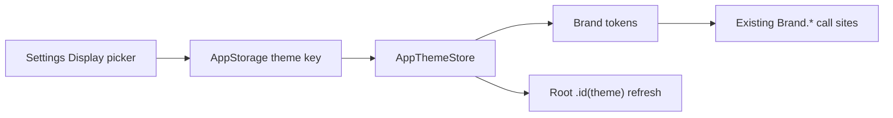

# Preset color themes (Settings)

**Target:** 1.1.x / later polish (iOS only)  
**Status:** Planned — saved 2026-09-21; not started  
**Cursor plan:** `.cursor/plans/puzzlebuddy_color_themes_88762e5d.plan.md` (workspace)

## Goal

Give users free control over app chrome via a small set of color presets. Themes swap accents + gradients; System/Light/Dark appearance stays independent.

This is **not** the later “thank-you unlock” cosmetic in FutureIdeas — all presets ship unlocked in Settings.

## Context

- Single palette today: `Brand` in `App/Util/DesignTokens.swift`
- Appearance already exists: `AppearancePreference` + Settings → Display
- Most UI already uses `Brand.*` → low call-site churn

## Presets

| ID | Name | Direction |
|----|------|------------|
| `classic` | Classic (default) | Current teal / warm orange / blue–teal gradient |
| `sunset` | Sunset | Warm coral primary, soft amber secondary |
| `forest` | Forest | Sage/green primary |
| `midnight` | Midnight | Indigo/violet primary |

Each preset defines: `accent`, `accentSecondary`, `accentWarm`, `gradientTop/Mid/Bottom`, and optional light/dark surface tints for `background` / `card` / `cardElevated`. Keep text tokens unless a preset needs a slight surface shift. White-on-accent contrast ≥ ~4.5:1 (see `docs/wcag.md`).

## Approach

1. **`AppColorTheme`** — `String` raw values, `CaseIterable`, labels for Settings.
2. **`BrandPalette` + `AppThemeStore`** — `@Observable` store; UserDefaults / `@AppStorage` key `PuzzleBuddy.ColorTheme` (mirror appearance in `UserPreferences`).
3. **Refactor `Brand`** — computed tokens from active palette; chrome modifiers keep working. Root `.id(selectedTheme)` so static `Brand` reads refresh on change.
4. **Settings** — Display section, below Appearance: picker with swatch + name; a11y labels/hints.
5. **Collage renderer** — resolve from active palette (no hardcoded Classic RGB). Leave launch/`AccentColor` assets as Classic.

## Out of scope

- Android port / Firebase theme events
- Alternate app icons
- Review-gated unlocks
- Per-screen or custom hex pickers

## Docs when shipping

- `docs/features.md` — Design system + Settings Display
- `docs/wcag.md` — contrast rows for new accents
- `FutureIdeas/backlog.md` — move to shipped / mark done

## Verification

- Flip each theme: tabs, primary buttons, list accents, stats, onboarding/splash
- Appearance (System/Light/Dark) still adapts under each theme
- Reduce Motion: flat `Brand.background` still theme-tinted
- Share collage matches selected palette
- Smoke build (PuzzleBuddy scheme)
